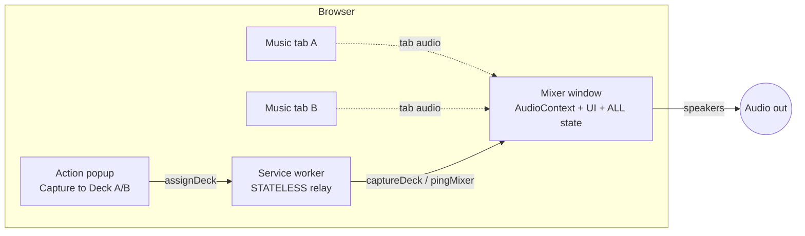
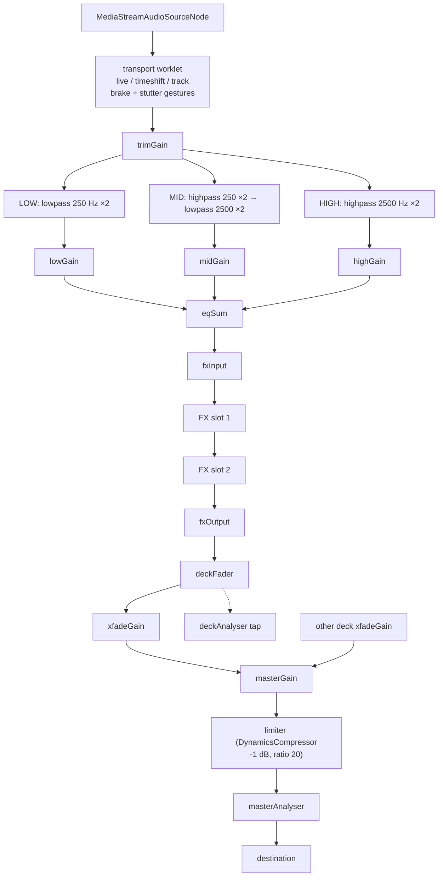

# TabDecks Architecture

Authoritative diagrams for extension contexts, the capture handshake, and the audio graph.
**Update this file when** adding/removing an entrypoint, adding a message type, or changing
the audio graph topology.

## Extension contexts



- **Mixer window** (`mixer.html`, opened as `type: 'popup'`): the only context that touches
  audio. Owns the `AudioContext`, all deck state, capture streams, and the UI.
- **Service worker**: stateless. Relays `assignDeck`, opens the mixer window if missing
  (liveness via `pingMixer` polling). Holds nothing across events.
- **Popup**: reads the active tab (the click grants `activeTab`), offers Deck A/B.

## Capture handshake

The streamId is single-use and expires within seconds — it is acquired *and consumed* in the
mixer page in the same task. The activeTab grant from the popup click persists on that tab.

```mermaid
sequenceDiagram
    participant U as User
    participant P as Popup
    participant SW as Service worker
    participant M as Mixer page
    U->>P: click action on music tab
    U->>P: "Capture to Deck A"
    P->>SW: assignDeck {deck, targetTabId, tabTitle}
    SW->>M: pingMixer (poll; create window if dead)
    M-->>SW: pong
    SW->>M: captureDeck {deck, targetTabId, tabTitle}
    M->>M: getMediaStreamId(targetTabId)
    M->>M: getUserMedia(streamId)  — same task, 1 retry
    M->>M: connect source into deck chain
    M-->>SW: {ok: true}
    SW-->>P: {ok: true}
```

## Audio graph (per deck → master)



Rules:
- One `AudioContext({latencyHint: 'interactive', sampleRate: 48000})`.
- Every audible param change goes through `src/audio/ramps.ts` (`setTargetAtTime`).
- Crossfader is equal-power: `gainA = cos(x·π/2)`, `gainB = sin(x·π/2)` (`src/dsp/curves.ts`).
- Deck disconnect (`track.onended`): only the source node is disconnected; the chain stays warm.

## Transport worklet port protocol

Each deck's transport worklet (`tabdecks-transport`) talks over its MessagePort:

**main → worklet:** `brake` · `stutter {sliceMs}` · `release` · `pause` · `play` ·
`setRate {rate}` · `seekBehind {seconds}` · `seekAbs {pos}` · `jumpLive` ·
`trackMark` · `trackRestart` · `trackExit`. `brakeTime` is a k-rate AudioParam.

**worklet → main:** `status {TransportStatus}` (~20 Hz: mode, gesture, behind, rate,
playing, absolute readPos/written/oldest, track markers) · `peaks {firstBucket, values}`
(waveform peaks, 1 per 512 samples) · `error {message}` (worklet latched to passthrough).

Absolute sample positions address the ring buffer (`src/dsp/ring-buffer.ts`); cues and
waveform buckets use the same addressing (`PeakStore` in `src/audio/transport.ts`).

## Message protocol

| Message | Direction | Payload | Response |
|---|---|---|---|
| `assignDeck` | popup → SW | `deck, targetTabId, tabTitle` | `AckResponse` |
| `captureDeck` | SW → mixer | `deck, targetTabId, tabTitle` | `AckResponse` |
| `pingMixer` | SW → mixer | — | `{pong: true}` (rejects if mixer closed) |

Source of truth: `src/messaging/protocol.ts`.

## Stability invariants

- SW holds zero state — killing it mid-mix has no effect.
- Engine methods are guarded (catch → log → `engineError` event); UI panels sit in
  `<svelte:boundary>` — a crashed component never touches the graph.
- Worklet `process()` never throws, always returns `true`; on internal error it latches to
  passthrough and reports via its port.
